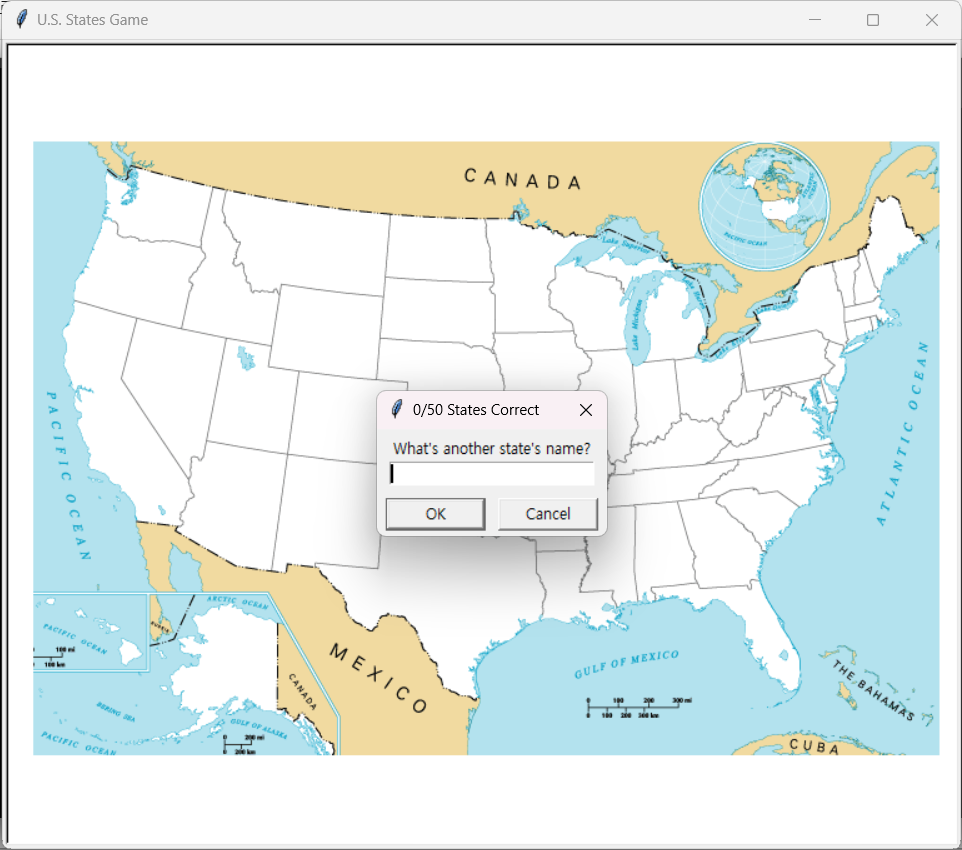

# U.S. States Quiz

This is a simple Python game built using the Turtle module that quizzes users on U.S. states. The game displays a map of the United States with the names of the states hidden. The player must guess the names of the states, and the program will mark each correct guess on the map.

## How to Play

1. Run the script.
2. A window will open displaying a map of the United States with the state names hidden.
3. Enter the name of a U.S. state when prompted.
4. If the guess is correct, the program will mark the state on the map and continue to the next prompt.
5. Repeat the process until all 50 states are correctly guessed or until you type "Exit" to quit the game.
6. If you exit the game before guessing all states, the program will generate a list of the remaining states to learn and save it to a CSV file named "states_to_learn.csv".

## Requirements

- Python 3.x
- Turtle module
- Pandas module

## Usage

1. Clone this repository to your local machine.
2. Ensure you have Python installed on your system.
3. Install the required modules by running `pip install pandas turtle` in your terminal.
4. Run the script by executing `python us_states_game.py` in your terminal.
5. Follow the on-screen prompts to play the game.

## Screenshots

## Download

You can download the executable file [here](https://drive.google.com/file/d/13uiyQrRILAGBq-Aj6o9Uts-7XBDwDFVu/view?usp=drive_link). 
Remember to download the following files and place them in the same directory as the executable:
- `50_states.csv`
- `states_to_learn.csv`
- `blank_states_img.gif`

Have fun learning U.S. states geography with this interactive game!

